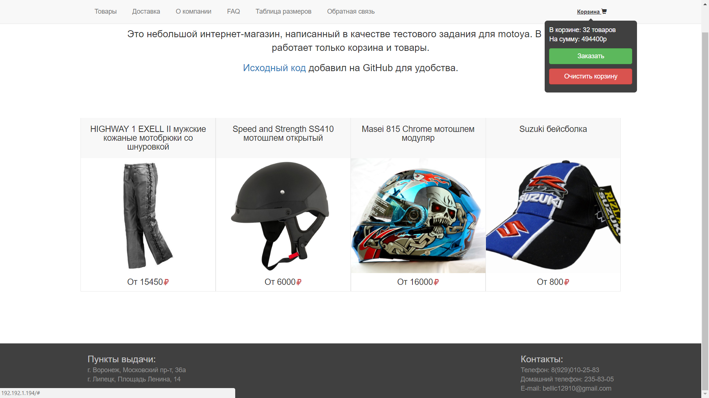
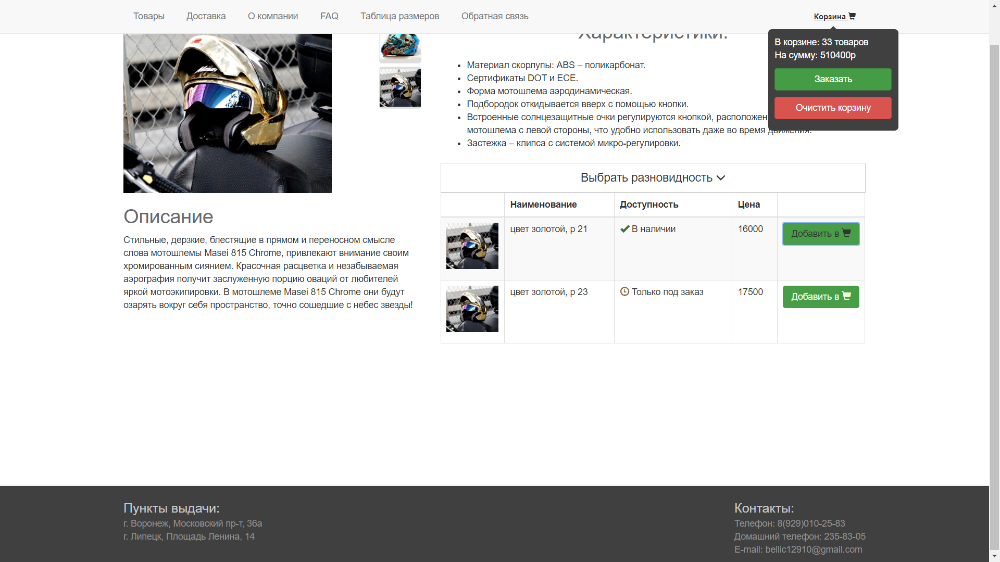
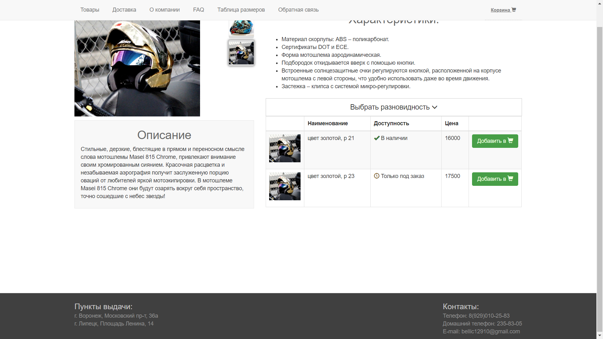
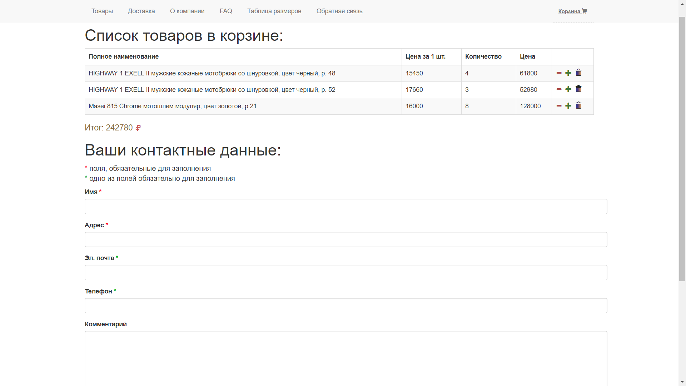

Index.php содержит в себе элементы товаров, при нажатии открывается страница с товаром и его вариантами
Корзина содержит в себе все выбранные товары, их количество, наименование и общую стоимость заказа

Страница с товаром содержит различные его вариации. Основная фотография меняется при выборе миниатюры

При выборе во всплывающем окне корзины можно выйти на страницу с заказом или удалить все выбранные товары

